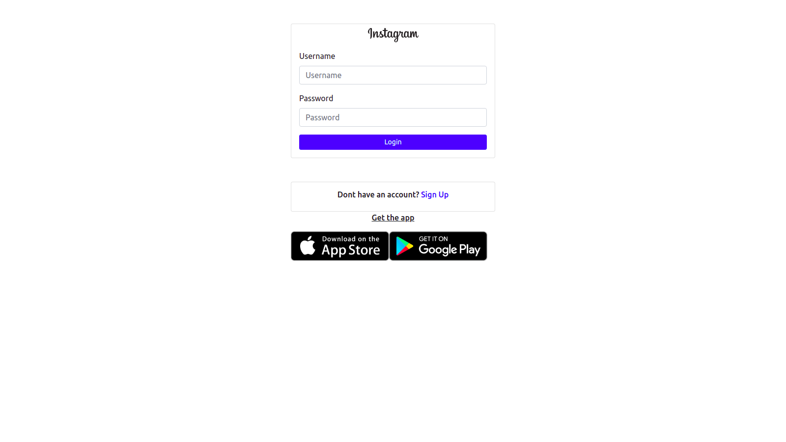
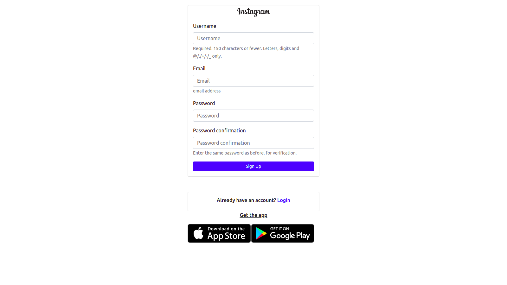
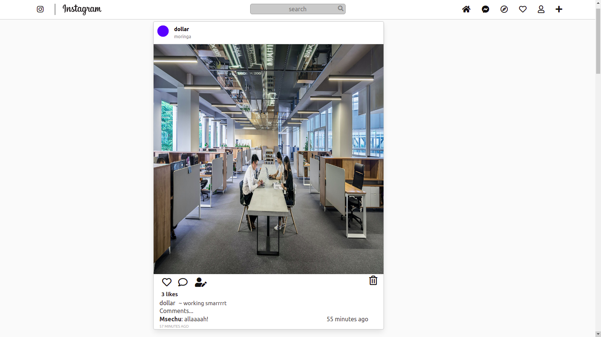
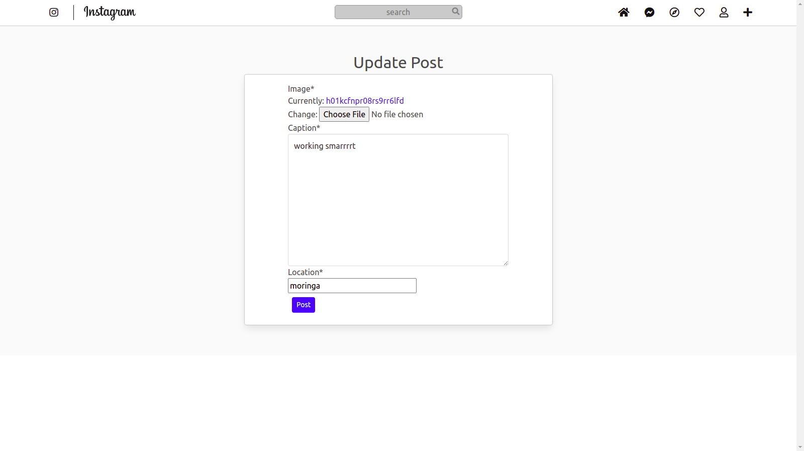
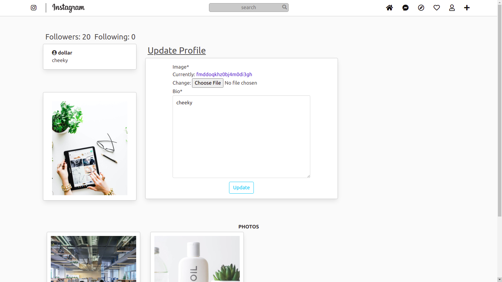
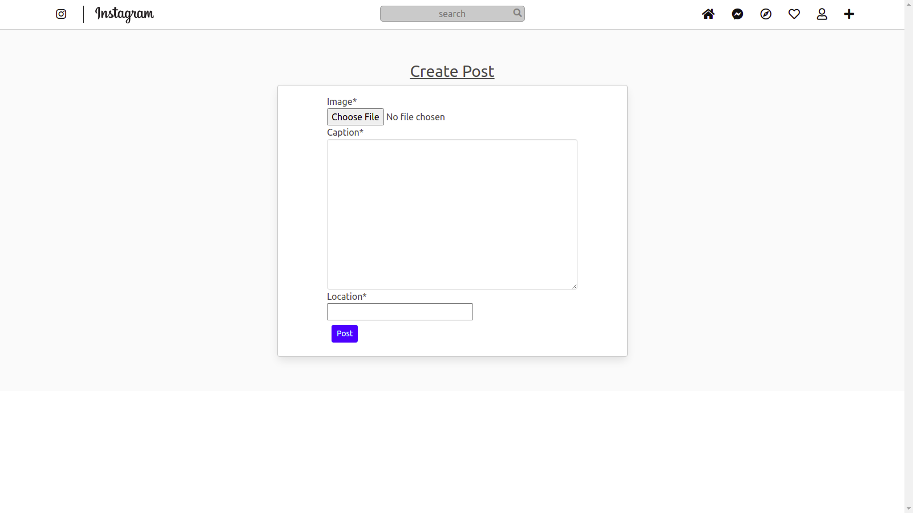
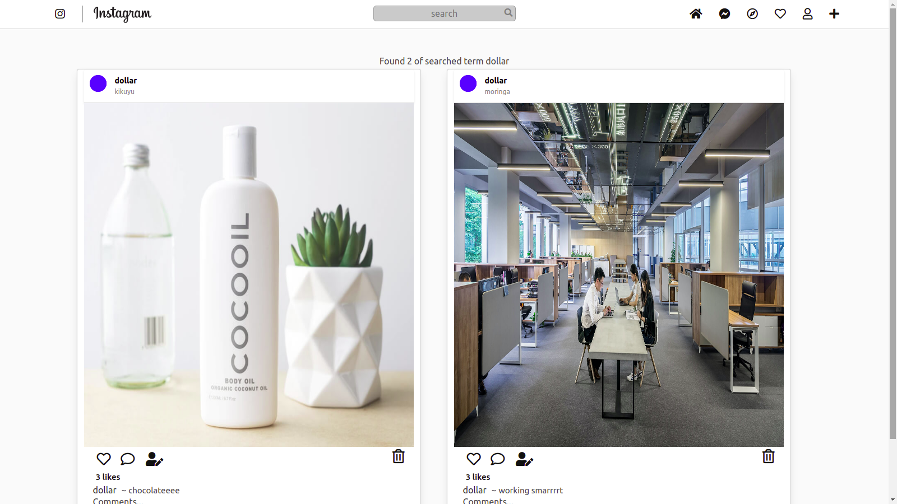

## INSTAGRAM
### PROJECT DEVELOPER;
 #### Nick Otieno.

### Project Description
#### ***a clone of the popular photo app Instagram***

### Setup Requirements
    - Github
    - Code Editor
    - Web Browser

### Setup Installation 
    - Fork app from github
    - Clone the app in your terminal using $git clone command
    -Create your database using:
    $psql
    CREATE DATABASE <database name>; and connect it in settings.py
    - Run the code in your code editor  using :
    $ python3 manage.py runserver

#### Technologies Used;
    - HTML
    - CSS
    - Django-3.2.8
    -Javascript

### LICENCE

#### Email :otienonick70@gmail.com
#### &copy;2021 Nick Otieno.
